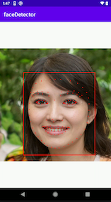

# Dataflow tutorial: Build face detector Android app with machine learning (MLKit).

### Text tutorial: https://simpledataflow.com/build-face-detector-android-app-with-machine-learning-mlkit-dataflow-tutorial/

### Video tutorials: check my youtube channel

In the tutorial, In this tutorial, we will create an android application that will recognize a human face and its contours.

